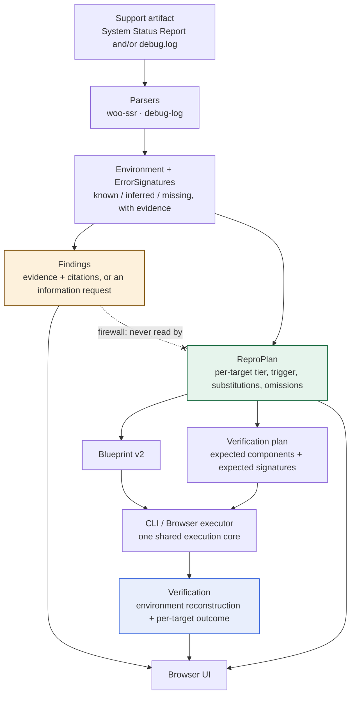

# WordPress Support Reproduction Engine

**Browser-first.** Turns WooCommerce System Status Reports and PHP debug logs
into evidence-backed diagnostics and reproducible WordPress Playground
environments — then actually runs them and reports what was observed.

```
Parse  →  Diagnose  →  Reproduce  →  Verify
```

No backend, no accounts, no AI. Everything runs in the page.

> **Status:** working prototype. Every claim below is backed by a test or a
> findings document in [`docs/`](docs/). Where something does not work,
> [Limitations](#limitations) says so.

---

## Quick start

```bash
npm ci
npm run dev        # http://localhost:5173
```

Paste [`fixtures/demos/quick-start.txt`](fixtures/demos/quick-start.txt) into the
box, press **Analyze**, then **Reproduce in WordPress Playground**. A real
WordPress boots inside the page — 14–18 s measured — and the run ends in
*"Trigger attempted, failure not observed"*, which is the honest answer for that
artifact. The [5-minute demo](#5-minute-demo) walks through every panel.

Requires Node.js 20+ (developed on 26, CI runs 22). Nothing else — no database,
no server, no API keys.

Want proof without the browser? `npm test` runs 453 tests in ~1.5 s with no
network; `npm run demo` runs four demos end to end against a real Playground.

---

## The problem

A WooCommerce support ticket usually arrives as two blobs of text: a System
Status Report and a PHP fatal from `debug.log`. Working out what the site
actually looked like, what is wrong, and whether you can reproduce it is manual,
slow, and easy to get wrong — particularly the last part. "I couldn't reproduce
it" is ambiguous: it can mean the bug is gone, or that you never built the right
environment in the first place.

So the last step is never collapsed into a single boolean. Four outcomes are
reported, and never confused:

| Outcome | Meaning |
| --- | --- |
| **Environment failed** | The environment did not boot. This says nothing about the bug. |
| **Trigger not attempted** | It booted, but no supported trigger existed for this signature. |
| **Trigger attempted, failure not observed** | The trigger ran; the reported failure did not appear. |
| **Failure reproduced** | The trigger ran and produced a log entry matching the report. |

---

## What it does, in seven parts

Not claims of novelty — just what the pipeline is made of and why each piece
earns its place.

1. **A canonical Environment IR.** Both adapters — System Status Report and
   debug log — produce one representation. Every scalar is `known`, `inferred`
   or `missing`, and there is no fourth state: absent data never becomes a
   default. Each value carries the verbatim line it came from.

2. **Evidence-backed deterministic Findings.** Every `Finding` carries evidence
   quoting the customer's own text plus at least one authoritative citation. No
   evidence or no citation and the engine discards it — the rule cannot opt out.
   Severity and confidence stay independent axes. No model is involved in any
   decision.

3. **A diagnosis/reproduction firewall.** The reproduction planner may not read
   a `Finding`, a rule, a severity or a confidence, so a wrong diagnosis cannot
   steer the reproduction toward confirming itself. Enforced three ways: no
   import edge, no diagnostic identifier anywhere in the module, and nothing
   diagnostic in the serialised plan.

4. **Explicit reproducibility classification.** An A–E tier *per reproduction
   target*, not one verdict for the whole report. Targets are independent: a
   blocked theme target does not downgrade an unrelated plugin target.

5. **Blueprint generation.** A schema-valid Playground v2 Blueprint pinning the
   reported versions. Every difference Playground forces — SQLite for MySQL, a
   coarser PHP version, debug logging enabled to capture evidence — is recorded
   as an explicit substitution. Nothing is silently defaulted, and anything that
   cannot be installed becomes a recorded omission with a reason.

6. **Actual Playground execution.** The plan is booted for real, on the CLI and
   in the browser, from one shared execution core. What installed is read back
   out of WordPress with `get_plugins()` rather than assumed from the Blueprint,
   because a zero exit code proves nothing.

7. **Verification from newly produced debug-log evidence.** `debug.log` is
   snapshotted, the trigger is executed, it is snapshotted again, and only the
   *newly written* entries count. A pre-existing boot error can never be
   reported as a reproduction, and `observed` is true only when the trigger ran
   **and** what it produced matches what was reported.

---

## Architecture



Two things the diagram is making explicit:

- **The dashed edge is the reproduction firewall.** The planner never reads a
  `Finding`, so a wrong diagnosis cannot steer the reproduction toward
  confirming itself. `src/repro/` imports nothing from `src/rules/`, asserted by
  a structural test.
- **Both executors are one implementation.** `cli-runner.ts` and
  `browser-runner.ts` each only boot an instance and hand it to the shared core
  in `execute/core.ts`; the three-way separation, the `debug.log` diff and the
  `observed` rule live there once. Sharing the code is not the same as assuming
  the surfaces agree — parity is measured, and currently shows 0 divergences
  across 9 compared fields.

Full detail in [`docs/ARCHITECTURE.md`](docs/ARCHITECTURE.md).

---

## Commands

```bash
npm run dev          # the application on http://localhost:5173
npm run typecheck    # strict TypeScript, no emit
npm test             # 453 unit + UI tests, no network
npm run build        # production build to dist/
npm run demo         # 4 demos end to end against real Playground
npm run spike:cli    # boot a Blueprint headlessly and introspect it
npm run spike:ui     # drive the real UI in Chromium against real Playground
npm run spike:parity # run one plan on both surfaces and compare
```

A Chromium browser is downloaded automatically the first time a browser test
runs. `npm run demo`, `spike:*` and the browser jobs need network access,
because Playground downloads WordPress core and plugins at boot.

The demo artifacts live in [`fixtures/demos/`](fixtures/demos/), with a README
explaining what each one demonstrates — including why demo C has no artifact at
all, and why demo B's environment deliberately stays unbootable.

---

## 5-minute demo

Every value below was read out of the running application on 2026-09-22. This is
the same artifact CI drives through the real UI on every push (`ui-e2e-spike`),
so it is verified continuously rather than once.

**1 — Start it.**

```bash
npm ci && npm run dev
```

Open http://localhost:5173. The masthead shows the six-step workflow and the
privacy statement.

**2 — Paste the artifact.** Paste all of
[`fixtures/demos/quick-start.txt`](fixtures/demos/quick-start.txt) — a small
System Status Report followed by a PHP fatal — into **Support artifact**. Leave
**Format** on *Auto-detect*.

**3 — Click Analyze.** The status line reads *Analysis complete.* and six panels
appear: Environment, Findings, Reproducibility, Blueprint, Reproduce, Pasted
artifact.

**4 — Inspect Environment.** Each value carries a provenance badge and the line
it came from:

| Field | Value | Provenance |
| --- | --- | --- |
| WordPress | 6.8.2 | `known`, line 4 |
| PHP | 8.2.15 | `known`, line 10 |
| WooCommerce | 8.5.2 | `known`, line 3 |
| Database | MySQL | **`inferred`**, line 11 |
| Web server | nginx/1.18.0 | `known`, line 9 |
| Memory limit | 256 MB | `known`, line 5 |
| Theme | *Not reported* | `missing` |

`MySQL` is *inferred*, not *known*, because WooCommerce prints every engine under
a `MySQL Version` label — MariaDB included. The theme is *missing*, not blank or
defaulted. Below the table: 1 plugin, `Classic Editor 1.6.3`, active, resolved to
slug `classic-editor` through the catalog.

**5 — Inspect the Finding.** One finding, *Fatal error originates in a plugin:
classic-editor*, with pills `Severity: Critical`, `Confidence: high` and the rule
id `FATAL_PLUGIN_OWNER` — severity and confidence are independent axes. It has
five labelled parts: Explanation, Evidence, Recommended remediation, Citations
and Reproducibility impact. The citation is *Debugging in WordPress* on
developer.wordpress.org. Ownership (`classic-editor`) came from the parsed
signature, not from the rule.

**6 — Click an evidence chip.** The chip under **Evidence** is labelled
`line 21`. Clicking it scrolls the Pasted artifact panel to line 21 and
highlights exactly that line — the `PHP Fatal error: Uncaught Error: Call to
undefined function classic_editor_missing()` line. Exactly one line is ever
highlighted, and neither the textarea nor the rendered source is modified.

**7 — Inspect Reproducibility.** Plan verdict **B — Reproducible with
substitution**. `Target #0` carries three pills — the tier, `reproducible`, and
`Trigger supported` — plus `Owner: plugin (classic-editor)` and `Attribution
confidence: high`. Its trigger is **Activate plugin: classic-editor**, and *Why*
lists the coded reasons the planner recorded.

**8 — Inspect substitutions and omissions.** Three substitutions, none silent:

- `PHP 8.2.15` → `PHP 8.2 (patch release chosen by Playground)`
- `MySQL 8.0.35` → `SQLite (SQLite Database Integration)`
- the report's own `WP_DEBUG` setting → `WP_DEBUG = true, WP_DEBUG_LOG = true`

And two omissions, each with its relevance to the failure marked *Unknown*: the
web server `nginx/1.18.0` and the `PHP memory limit 256 MB`.

**9 — View or copy the Blueprint.** *View Blueprint* expands the generated v2
JSON; *Copy Blueprint* copies it. It pins `classic-editor@1.6.3` and sets
`wordpressVersion: "6.8.2"`, `phpVersion: "8.2"`. The panel is read-only — there
is no editable field in it — and says the Blueprint represents the reported
environment, not a recommended one.

**10 — Click "Reproduce in WordPress Playground".** Four stages appear in order:
Booting WordPress Playground → Checking what actually installed → Executing
reproduction triggers → Collecting verification results.

**11 — Confirm WordPress appears.** A real WordPress renders in the Playground
panel, and the analysis stays on screen beside it. Measured end to end: **14.5 s
and 17.9 s** in two runs on a warm cache. The frame is a genuine site — CI asserts
that by reading the frame's own document (title `My WordPress Website`), not by
looking at pixels, because a screenshot that lied is exactly what produced the
withdrawn Phase 6 defect report.

**12 — Inspect environment verification.** *Environment reconstruction:* **Boot
succeeded**, `Installed components (1)` → `classic-editor@1.6.3 (active)`,
`Failed components (0)`. That line was read back out of WordPress with
`get_plugins()`, not copied from the Blueprint.

**13 — Inspect target verification.** *Target #0:* **Trigger attempted, failure
not observed** — Trigger `Activate plugin: classic-editor`, Attempted **Yes**,
Observed **No**, with the reason *"the trigger ran and wrote no new debug.log
entries"*.

That last panel is the point of the whole tool. The synthetic fatal in the
artifact does not actually occur in Classic Editor 1.6.3, so the honest result is
that the environment was rebuilt, the trigger really ran, and the bug did not
appear — three separate facts, instead of one misleading *"not reproducible"*.

## A second artifact: when the environment cannot be built

[`fixtures/demos/demo-b-plugin-fatal.txt`](fixtures/demos/demo-b-plugin-fatal.txt)
is a larger report — WordPress 6.4.3, PHP 8.1.27, WooCommerce 8.5.2, Storefront,
6 plugins — and it analyses cleanly: `FATAL_PLUGIN_OWNER` at `critical`/`high`,
tier **B**, trigger `Activate plugin: woocommerce`, Blueprint pinning
`woocommerce@8.5.2`.

Its reproduction **fails**, and the failure is instructive. One reported plugin,
`wordfence@7.11.4`, throws `WP_MySQL_On_SQLite_Exception` from `wfDB.php` during
activation, because Playground runs on SQLite rather than MySQL. Installation is
all-or-nothing, so the whole boot aborts:

> **Boot failed** — Installed components (0), Failed components (6), every one
> marked `(boot failed)`. Target #0: **Environment failed** — *"The environment
> did not boot, so this target's trigger was never run. This says nothing about
> whether the reported failure is reproducible."*

Verified deterministic on both surfaces (CLI and browser), and isolated to that
one plugin: dropping `wordfence@7.11.4` boots the same environment successfully
with `woocommerce@8.5.2 (active)` and four other plugins installed. Reported
rather than hidden — the distinction between *the bug did not reproduce* and *we
could not build the environment* is exactly what this tool exists to keep
visible.

---

## Limitations

Established by experiment, not assumed. Sources in `docs/phase-*-findings.md`.

**Environment fidelity**

- **SQLite, not MySQL/MariaDB.** Playground runs WordPress on SQLite. Every
  reported MySQL site is therefore reconstructed on a different engine, recorded
  as an explicit substitution. In practice this means **tier A is unreachable**
  for any report that names a database.
- **PHP is pinned to major.minor**; a reported patch release cannot be
  reproduced. Playground offers 5.2, 7.4, 8.0–8.5 — notably **not 7.0–7.3**.
- **The web server and PHP memory limit cannot be reproduced** and are recorded
  as omissions with unknown relevance.

**Components**

- **Premium plugins, unresolved plugins, must-use plugins, drop-ins and themes
  cannot be installed.** Each becomes an explicit omission with a reason. A slug
  is never guessed from a display name.
- **Plugin slugs resolve only through a bundled 31-entry catalog**, keyed by
  `(name, author)`. Coverage of real reports is therefore partial by design.
- **Installation is all-or-nothing: one bad component aborts the whole boot.**
  That covers both a version that cannot be downloaded and a plugin that
  installs but fatals under Playground's SQLite emulation — `wordfence@7.11.4`
  does exactly the latter and takes demo B's entire environment down with it.
  The failure is attributed to the boot rather than swallowed, and every target
  is reported as *Environment failed*, never as *not reproduced*.
- **A pinned version only resolves while the package is published.**
  `slug@version` is fetched from wordpress.org; a version withdrawn from the
  directory cannot be installed, and no nearby version is silently substituted
  for it.
- **A component that cannot be installed makes its target dependency-bound.**
  Those targets are classified tier **D** and are never attempted, so nothing is
  claimed about a failure whose environment was never built.
- Because implication requires a known path, and the components we cannot
  install are exactly those whose slugs we do not know, **"relevant omission" is
  structurally almost unreachable**.

**Reproduction**

- **Supported triggers are boot, plugin activation and admin page load only.**
  Checkout, webhooks and payment callbacks have no executable trigger and are
  never claimed.
- **Plugin activation is really re-activation** (deactivate, then activate),
  because the Blueprint activates at boot. Recorded on every affected result.
- **No structured error data exists.** Error class and message are regex
  extractions from raw `debug.log` text; the extraction method and whether it
  was deterministic are recorded per target.
- **Only newly written `debug.log` entries count as evidence.** Entries present
  before the trigger ran are discarded, which is what stops a boot-time error
  being sold as a reproduction — but it also means a failure that writes nothing
  to the log (a wrong page, a silent data error, a JavaScript fault) can never
  be observed here, however real it is.
- **No repository plugin in the corpus fatals on activation** under any PHP
  version Playground offers, so the `observed = true` demo uses a controlled
  injected plugin. Three real candidates were tested and rejected — see
  [`fixtures/demos/README.md`](fixtures/demos/README.md).

**Runtime and scope**

- **The embedding page must not be cross-origin isolated**, or the Playground
  iframe is blocked and boot never resolves.
- **Browser results are verified in Chromium only.**
- **Network is required** to launch a reproduction: Playground downloads
  WordPress core and plugins from wordpress.org.
- **Boots fail transiently.** One `npm run demo` run on 2026-09-22 failed with
  *"Error connecting to the SQLite database"* and the next, unchanged, passed.
  Only Demo C's boot is retried automatically, so a red demo run is worth
  repeating before it is believed.
- Only the **plain-text** System Status export is parsed, and only **English**
  labels; a localised report is detected and reported as unreadable rather than
  silently parsed as empty.
- The diagnostic corpus is **4 rules**, deliberately — rules without an
  authoritative source were not written.

---

## Privacy

**This project has no backend, so nothing here receives the artifact you paste.**
Parsing, diagnosis, planning and Blueprint generation all run in the page, and a
test asserts that no `fetch`, `XMLHttpRequest` or `navigator.sendBeacon` call
occurs during analysis. Nothing is stored or exported either — there is no
persistence layer.

**Launching a reproduction is a network operation**, and the UI says so above the
button. Playground runs inside an iframe served by `playground.wordpress.net`,
and the Blueprint's components are downloaded from `wordpress.org`. The pasted
text itself is not transmitted, but the requests are *derived* from it: the
WordPress version, the PHP version and each plugin `slug@version` taken from the
report become part of that traffic. So this is not an offline tool, and it is not
a claim that your data stays on your machine — only that it is never sent to a
server belonging to this project. If an artifact cannot be shared with third-party
infrastructure, analyse it and stop before the reproduction step.

---

## Testing

**453 tests run offline in ~1.5 s.** `npm test` needs no network, no database and
no Playground: every fixture, schema and catalog entry it reads is committed.

| Suite | Tests | What it covers |
| --- | --- | --- |
| `woo-ssr-parser` | 82 | System Status Report parsing: sections, continuation rows, code fences, CRLF, reordering, unknown fields, localised reports, `Field` provenance and evidence line numbers |
| `debug-log-parser` | 33 | Fatal → `ErrorSignature`, including ownership attribution and the refusal to guess a slug |
| `rules` | 92 | The diagnostic engine: matching, the evidence gate, the citation gate, severity/confidence independence, and `InformationRequest` when required fields are missing |
| `repro-planner` | 150 | Relevance, per-target tiers, triggers, substitutions, omissions, Blueprint generation and determinism |
| `log-evidence` | 23 | Verification evidence in isolation: entry splitting, the before/after diff, extraction and signature comparison |
| `ui/app` | 40 | Rendering, the state machine, evidence-chip highlighting, the read-only Blueprint, and the four verification outcomes |
| `ui/analyze` | 16 | Format detection and the rule that a non-running adapter contributes no provenance |
| `blueprint-schema` | 9 | Every committed Blueprint validated against a committed copy of the published v2 schema, plus negative cases so a permissive validator cannot pass |
| `repro-firewall` | 8 | Structural: no file under `src/repro/` may import the diagnostic layer, mention a diagnostic identifier, or leak one into the serialised plan |

Two cross-cutting checks run inside those suites rather than as separate
commands: a **property test** asserting that every `Finding`'s evidence excerpt
appears verbatim at the line it cites, for every diagnosis case; and a
**determinism check** running each parser fixture, diagnosis case and planner
case twice and comparing the results.

Everything below boots a real Playground, so all of it **requires network
access** — Playground downloads WordPress core and plugins at boot — and the
browser rows additionally download Chromium on first run.

| Command | Kind | What it proves |
| --- | --- | --- |
| `npm run spike:cli` | CLI integration | A Blueprint boots headlessly, and the running site is introspected instead of trusting an exit code |
| `npm run spike:execute` | CLI execution | The full execute-and-verify path on the CLI surface |
| `npm run spike:parity` | Browser integration | The same plan executed on both surfaces and compared — 0 divergences across 9 fields |
| `npm run spike:ui` | UI end-to-end | Drives the real application in Chromium against a real Playground, using `fixtures/demos/quick-start.txt`, and asserts the site rendered by reading the frame's own document rather than pixels |
| `npm run demo` | Real Playground demo | All four demos, including one target reaching `observed = true` and one reaching `observed = false`. Demo C's boot is retried once, and a failure that survives the retry is reported as an *infrastructure failure*, not as a demo regression |

`npm run typecheck` (strict, no emit) and `npm run build` need no network;
`npm run spike:bisect` is the Phase 6.1 debugging harness and is deliberately not
wired into CI.

CI runs seven jobs on `ubuntu-latest` on every push: **`check`** (`npm run
typecheck` + `npm test`), **`cli-spike`**, **`execute-spike`**,
**`browser-parity-spike`**, **`ui-e2e-spike`**, **`demo-e2e`** and
**`v2-plugins-probe`** — the last being the Phase 0 probe that re-checks, on
Linux, the Blueprint v2 + plugins failure originally seen on macOS.

---

## Documentation

- [`docs/ARCHITECTURE.md`](docs/ARCHITECTURE.md) — how the layers fit together
- [`docs/SPEC.md`](docs/SPEC.md) — the authored specification
- [`docs/rules.md`](docs/rules.md) — what each diagnostic rule detects
- [`docs/parser-woo-ssr.md`](docs/parser-woo-ssr.md) — accepted input and parser behaviour
- `docs/phase-*-findings.md` — what was measured at each stage, including what
  did not work and one defect report that was later withdrawn as wrong
