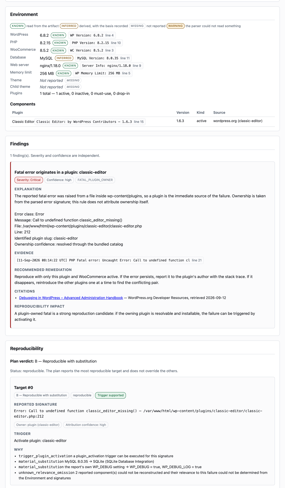
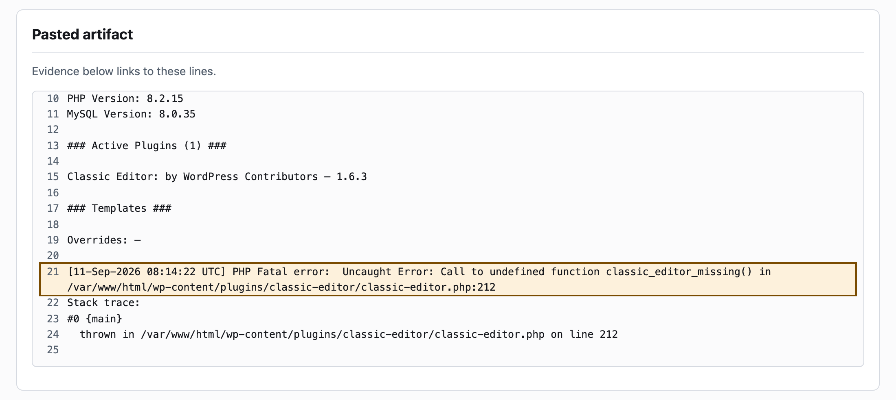
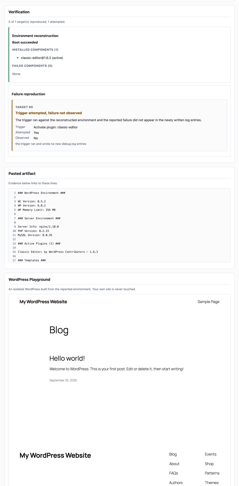
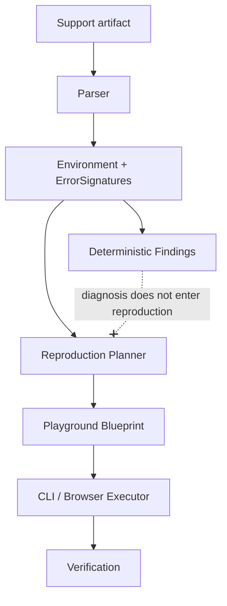

# WordPress Support Reproduction Engine

[](https://github.com/lucyeos07/wordpress-support-reproduction-engine/actions/workflows/ci.yml)

> Browser-first tooling that turns WordPress/WooCommerce support artifacts into
> evidence-backed diagnosis and reproducible WordPress Playground environments.

**Parse → Diagnose → Reproduce → Verify**

Paste a WooCommerce System Status Report and the PHP fatal from `debug.log`. The
tool builds a structured environment in which every value is marked `known`,
`inferred` or `missing` and linked to the line it came from, then applies
deterministic rules that must cite their evidence to produce a finding at all.
It compiles the result into a WordPress Playground Blueprint, boots that
environment for real inside the page, runs the reported failure's trigger, and
reports what was actually observed — never collapsing "we could not build it"
and "the bug did not happen" into one answer.

```bash
npm ci && npm run dev     # http://localhost:5173
```

Paste [`fixtures/demos/quick-start.txt`](fixtures/demos/quick-start.txt), press
**Analyze**, then **Reproduce in WordPress Playground**. No backend, no accounts,
no AI, no API keys.

---

## Screenshots

**Analysis** — environment provenance, a deterministic finding with its evidence
and citation, and the reproduction plan.



**Evidence** — clicking the `line 21` chip on a finding highlights exactly the
line of the pasted artifact it cites.



**Reproduction and verification** — the environment is rebuilt and checked, the
trigger is executed, and a real WordPress runs inside the page.



---

## What it does

| Stage | What happens |
| --- | --- |
| **Parse** | Two adapters — System Status Report and `debug.log` — produce one canonical `Environment` plus zero or more `ErrorSignature`s. Every scalar is `known`, `inferred` or `missing`, carrying the verbatim line it came from. There is no fourth state and no defaults. |
| **Diagnose** | Deterministic rules, defined as data. A match with no evidence or no authoritative citation is discarded by the engine — a rule cannot opt out. Severity and confidence stay independent axes. |
| **Reproduce** | A per-target A–E reproducibility tier, a trigger, and a schema-valid Playground v2 Blueprint pinning the reported versions. Every difference Playground forces is recorded as an explicit substitution; anything uninstallable becomes a recorded omission. |
| **Verify** | The Blueprint is booted for real. Installed components are read back out of WordPress with `get_plugins()`, and the failure is established only by diffing `debug.log` around the trigger. |

No model is involved in any decision, and nothing is persisted or uploaded.

---

## Architecture



Both layers hang off the same IR; neither is downstream of the other. The dashed
edge is the firewall: `src/repro/` may not import the diagnostic layer, may not
mention a diagnostic identifier with comments stripped, and may not leak one into
the serialised plan — all three asserted in `tests/repro-firewall.test.ts`.

`cli-runner.ts` and `browser-runner.ts` each only boot an instance and hand it to
the shared core in `execute/core.ts`, so the two surfaces cannot drift in
semantics. Full detail in [`docs/ARCHITECTURE.md`](docs/ARCHITECTURE.md).

---

## 5-minute demo

Every value below was read out of the running application. This is the same
artifact CI drives through the real UI on every push, so the walkthrough is
verified continuously. Step-by-step detail in
[`docs/FINAL-REVIEW.md`](docs/FINAL-REVIEW.md#five-minute-demo).

1. `npm ci && npm run dev`, then open http://localhost:5173.
2. Paste [`fixtures/demos/quick-start.txt`](fixtures/demos/quick-start.txt); leave **Format** on *Auto-detect*.
3. Press **Analyze**.
4. **Environment** — WordPress 6.8.2, PHP 8.2.15, WooCommerce 8.5.2, all `known` with line numbers. The database reads `MySQL` **`inferred`**, because WooCommerce prints every engine under a `MySQL Version` label; the theme reads *Not reported*, `missing`.
5. **Finding** — *Fatal error originates in a plugin: classic-editor*, `Severity: Critical`, `Confidence: high`, citing WordPress.org's debugging handbook. Ownership came from the parsed signature, not from the rule.
6. **Evidence** — click the `line 21` chip; exactly that line of the artifact is highlighted.
7. **Reproducibility** — tier **B**, trigger `Activate plugin: classic-editor`, three substitutions listed (PHP 8.2.15 → 8.2, MySQL 8.0.35 → SQLite, debug logging forced on) and two omissions.
8. **Blueprint** — read-only and copyable, pinning `classic-editor@1.6.3`.
9. **Reproduce in WordPress Playground** — four stages; a real WordPress renders in the page. Measured **14.5 s and 17.9 s** end to end on a warm cache.
10. **Environment verification** — *Boot succeeded*, `classic-editor@1.6.3 (active)` read back out of WordPress, zero failed components.
11. **Target verification** — **Trigger attempted, failure not observed**, because this synthetic fatal does not occur in Classic Editor 1.6.3. The environment was rebuilt, the trigger really ran, and the bug did not appear: three separate facts.

---

## Why the architecture is designed this way

**One canonical IR, because two very different inputs feed one pipeline.**
Without it, every rule and the planner would each have to understand both a
structured report and an unstructured log, and "absent" would be expressed
differently in each path. `Field<T>` has no constructor that accepts a fallback,
so "not reported" cannot quietly become a default anywhere downstream.

**Diagnosis and reproduction are separated, because a wrong diagnosis must not be
able to prove itself.** If the planner could read a `Finding`, it would select
the trigger that confirms it. Keeping them apart means the reproduction tests the
*reported environment* independently and can contradict the diagnosis. An
import-edge check alone was not enough — reading a conclusion through a
structural type would pass it — so the identifiers are forbidden textually too.

**Every finding needs evidence and a citation, enforced centrally.** Both gates
live in the engine rather than in each rule, so a match without the customer's
own verbatim line, or without an authoritative source, is discarded rather than
downgraded. Version-specific claims cite that exact version's `readme.txt`; a
version missing from the table makes the rule `not_applicable` instead of
extrapolating.

**Verification reads the site, not the exit code.** No Playground surface exposes
structured PHP error data — a CLI fatal still returns HTTP 200 — so the only
honest signal is the site itself: snapshot `debug.log`, run the trigger, snapshot
again, and count only newly written entries. That is what stops a boot-time error
being sold as a reproduction.

**Parity is measured, not assumed.** Sharing a core proves the code is identical,
not that a Node process and wasm in an iframe behave alike. The same plan runs on
both surfaces and nine fields are compared: **0 divergences of 9**, with a
deliberately wrong signature in the same run to prove the comparison can fail.

---

## Reproducibility model

Reproducibility is a **per-target** classification, not one verdict for the
report. A blocked theme target does not downgrade an unrelated plugin target.

| Tier | Meaning |
| --- | --- |
| **A** | Reproducible as reported |
| **B** | Reproducible with substitution — e.g. SQLite standing in for MySQL |
| **C** | Environment-bound — depends on infrastructure Playground cannot provide |
| **D** | Dependency-bound — depends on an external or uninstallable component |
| **E** | Insufficient evidence to responsibly attempt it |

The result of an execution is one of four outcomes, never collapsed into a
boolean:

| Outcome | Meaning |
| --- | --- |
| **Environment failed** | The environment did not boot. This says nothing about the bug. |
| **Trigger not attempted** | It booted, but no supported trigger existed for this signature. |
| **Trigger attempted, failure not observed** | The trigger ran; the reported failure did not appear. |
| **Failure reproduced** | The trigger ran and produced a log entry matching the report. |

**A worked example of the first outcome.**
[`fixtures/demos/demo-b-plugin-fatal.txt`](fixtures/demos/demo-b-plugin-fatal.txt)
analyses cleanly — tier B, trigger `Activate plugin: woocommerce`, Blueprint
pinning `woocommerce@8.5.2` — but its environment does not boot:
`wordfence@7.11.4` throws `WP_MySQL_On_SQLite_Exception` from `wfDB.php` during
activation, because Playground runs on SQLite. Installation is all-or-nothing, so
every component is reported failed and the target reads **Environment failed**,
explicitly not *not reproduced*. Verified deterministic on both surfaces and
isolated to that one plugin: dropping it boots the same environment with
`woocommerce@8.5.2 (active)` and four others installed.

---

## Limitations

Established by experiment, not assumed. Sources in `docs/phase-*-findings.md`;
the full list is in [`docs/FINAL-REVIEW.md`](docs/FINAL-REVIEW.md#known-limitations).

- **Playground runs on SQLite, not MySQL/MariaDB**, so every reported MySQL site
  is rebuilt on a different engine — which makes **tier A unreachable** for any
  report naming a database. Tier C is defined but unreached by any fixture.
- **PHP is pinned to major.minor**; Playground offers 5.2, 7.4 and 8.0–8.5, not
  7.0–7.3. The web server and memory limit cannot be reproduced at all.
- **Installation is all-or-nothing**: one component that cannot be downloaded, or
  that fatals under SQLite, aborts the whole boot.
- **Premium, unresolved, must-use and drop-in components and themes cannot be
  installed**, and a slug is never guessed from a display name. Slugs resolve
  only through a bundled **31-entry catalog**.
- **Supported triggers are boot, plugin activation and admin page load only**,
  and activation is really re-activation, because the Blueprint activates at
  boot. Checkout, webhooks and payment callbacks are never claimed.
- **Only newly written `debug.log` entries count as evidence**, so a failure that
  logs nothing cannot be observed here at all. Error class and message are regex
  extractions; each target records whether the extraction was deterministic.
- **Browser results are verified in headless Chromium only**, and the embedding
  page must not be cross-origin isolated.
- **Only English plain-text System Status exports are parsed**; a localised
  report is reported as unreadable rather than parsed as empty.
- **Network is required** for any reproduction, and boots fail transiently — one
  `npm run demo` run failed with *"Error connecting to the SQLite database"* and
  the next, unchanged, passed.
- The diagnostic corpus is **4 rules and 11 recorded version requirements**,
  deliberately: rules without an authoritative source were not written.

---

## Testing

**453 tests across 9 suites, offline, in ~1.5 s.** No network, no database, no
Playground — every fixture, schema and catalog entry they read is committed.

| Suite | Tests | Covers |
| --- | --- | --- |
| `repro-planner` | 150 | Relevance, per-target tiers, triggers, substitutions, omissions, Blueprints, determinism |
| `rules` | 92 | Matching, the evidence gate, the citation gate, information requests |
| `woo-ssr-parser` | 82 | Sections, continuation rows, code fences, CRLF, unknown fields, localised reports |
| `ui/app` | 40 | Rendering, state machine, evidence highlighting, the four outcomes |
| `debug-log-parser` | 33 | Signature extraction and ownership attribution |
| `log-evidence` | 23 | Entry splitting, the before/after diff, extraction, comparison |
| `ui/analyze` | 16 | Format detection; a non-running adapter contributes no provenance |
| `blueprint-schema` | 9 | Validation against the published v2 schema, plus negative cases |
| `repro-firewall` | 8 | The diagnosis/reproduction boundary, three ways |

Two cross-cutting checks run inside those suites: a **property test** asserting
every finding's evidence excerpt appears verbatim at the line it cites, and a
**determinism check** running each fixture and case twice.

These need network, because Playground downloads WordPress core and plugins:

| Command | Proves |
| --- | --- |
| `npm run spike:cli` · `npm run spike:execute` | CLI integration: a Blueprint boots and the running site is introspected |
| `npm run spike:parity` | Browser integration: both surfaces compared — 0 divergences of 9 |
| `npm run spike:ui` | UI end-to-end in Chromium, asserting the site rendered by reading the frame's document, not pixels |
| `npm run demo` | Four demos, including one target reaching `observed = true` and one reaching `observed = false` |

CI runs seven jobs on `ubuntu-latest` on every push: `check`, `cli-spike`,
`execute-spike`, `browser-parity-spike`, `ui-e2e-spike`, `demo-e2e` and
`v2-plugins-probe`.

---

## Local development

Node.js 20+ (developed on 26, CI runs 22). Nothing else — no database, no server,
no API keys.

```bash
npm ci
npm run dev          # the application on http://localhost:5173
npm run typecheck    # strict TypeScript, no emit
npm test             # 453 tests, no network
npm run build        # production build to dist/
npm run demo         # 4 demos end to end against real Playground
```

Spike harnesses, each needing network: `spike:cli`, `spike:execute`,
`spike:browser` (serves the spike pages), `spike:parity`, `spike:ui`,
`spike:bisect` (the Phase 6.1 debugging harness). Chromium downloads
automatically the first time a browser spike runs.

The demo artifacts live in [`fixtures/demos/`](fixtures/demos/), with a README
explaining what each one demonstrates — including why demo C has no artifact and
why demo B's environment deliberately stays unbootable.

---

## Privacy

**This project has no backend, so nothing here receives the artifact you paste.**
Parsing, diagnosis, planning and Blueprint generation all run in the page, and a
test asserts no `fetch`, `XMLHttpRequest` or `navigator.sendBeacon` call occurs
during analysis. Nothing is stored or exported.

**Launching a reproduction is a network operation**, and the UI says so above the
button. Playground runs in an iframe served by `playground.wordpress.net` and
downloads components from `wordpress.org`. The pasted text is not transmitted,
but the requests are derived from it — the WordPress version, the PHP version and
each plugin `slug@version` become part of that traffic. If an artifact cannot be
shared with third-party infrastructure, analyse it and stop before reproducing.

---

## Documentation

- [`docs/FINAL-REVIEW.md`](docs/FINAL-REVIEW.md) — verified capabilities, test and
  CI status, limitations, technical debt
- [`docs/ARCHITECTURE.md`](docs/ARCHITECTURE.md) — how the layers fit together
- [`docs/SPEC.md`](docs/SPEC.md) — the authored specification
- [`docs/rules.md`](docs/rules.md) — what each diagnostic rule detects
- [`docs/parser-woo-ssr.md`](docs/parser-woo-ssr.md) — accepted input and parser behaviour
- `docs/phase-*-findings.md` — what was measured at each stage, including what did
  not work and one defect report later withdrawn as wrong
