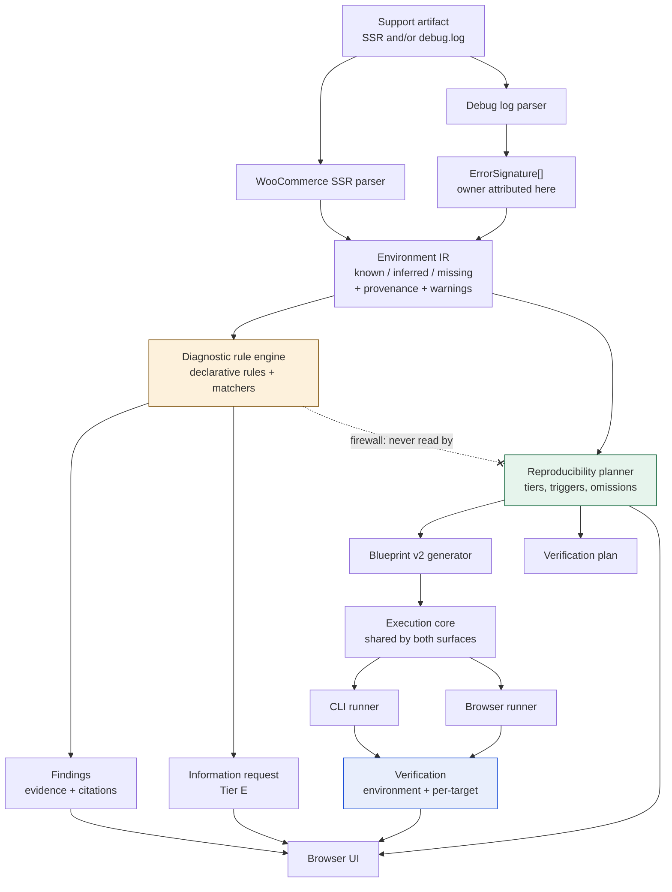

# WordPress Support Reproduction Engine

**Browser-first.** Turns WooCommerce System Status Reports and PHP debug logs
into evidence-backed diagnostics and reproducible WordPress Playground
environments — then actually runs them and reports what was observed.

```
Parse  →  Diagnose  →  Reproduce  →  Verify
```

No backend, no accounts, no AI. Everything runs in the page.

> **Status:** working prototype. Every claim below is backed by a test or a
> findings document in [`docs/`](docs/). Where something does not work,
> [Limitations](#limitations) says so.

---

## Quick start

```bash
npm ci
npm run dev        # http://localhost:5173
```

Paste [`fixtures/demos/demo-b-plugin-fatal.txt`](fixtures/demos/demo-b-plugin-fatal.txt)
into the box, press **Analyze**, then **Reproduce in WordPress Playground**. A
real WordPress boots inside the page in under 20 seconds.

Requires Node.js 20+ (developed on 26, CI runs 22). Nothing else — no database,
no server, no API keys.

Want proof without the browser? `npm test` runs 453 tests in ~1.5 s with no
network; `npm run demo` runs four demos end to end against a real Playground.

---

## The problem

A WooCommerce support ticket usually arrives as two blobs of text: a System
Status Report and a PHP fatal from `debug.log`. Working out what the site
actually looked like, what is wrong, and whether you can reproduce it is manual,
slow, and easy to get wrong — particularly the last part. "I couldn't reproduce
it" is ambiguous: it can mean the bug is gone, or that you never built the right
environment in the first place.

So the last step is never collapsed into a single boolean. Four outcomes are
reported, and never confused:

| Outcome | Meaning |
| --- | --- |
| **Environment failed** | The environment did not boot. This says nothing about the bug. |
| **Trigger not attempted** | It booted, but no supported trigger existed for this signature. |
| **Trigger attempted, failure not observed** | The trigger ran; the reported failure did not appear. |
| **Failure reproduced** | The trigger ran and produced a log entry matching the report. |

---

## What it does, in seven parts

Not claims of novelty — just what the pipeline is made of and why each piece
earns its place.

1. **A canonical Environment IR.** Both adapters — System Status Report and
   debug log — produce one representation. Every scalar is `known`, `inferred`
   or `missing`, and there is no fourth state: absent data never becomes a
   default. Each value carries the verbatim line it came from.

2. **Evidence-backed deterministic Findings.** Every `Finding` carries evidence
   quoting the customer's own text plus at least one authoritative citation. No
   evidence or no citation and the engine discards it — the rule cannot opt out.
   Severity and confidence stay independent axes. No model is involved in any
   decision.

3. **A diagnosis/reproduction firewall.** The reproduction planner may not read
   a `Finding`, a rule, a severity or a confidence, so a wrong diagnosis cannot
   steer the reproduction toward confirming itself. Enforced three ways: no
   import edge, no diagnostic identifier anywhere in the module, and nothing
   diagnostic in the serialised plan.

4. **Explicit reproducibility classification.** An A–E tier *per reproduction
   target*, not one verdict for the whole report. Targets are independent: a
   blocked theme target does not downgrade an unrelated plugin target.

5. **Blueprint generation.** A schema-valid Playground v2 Blueprint pinning the
   reported versions. Every difference Playground forces — SQLite for MySQL, a
   coarser PHP version, debug logging enabled to capture evidence — is recorded
   as an explicit substitution. Nothing is silently defaulted, and anything that
   cannot be installed becomes a recorded omission with a reason.

6. **Actual Playground execution.** The plan is booted for real, on the CLI and
   in the browser, from one shared execution core. What installed is read back
   out of WordPress with `get_plugins()` rather than assumed from the Blueprint,
   because a zero exit code proves nothing.

7. **Verification from newly produced debug-log evidence.** `debug.log` is
   snapshotted, the trigger is executed, it is snapshotted again, and only the
   *newly written* entries count. A pre-existing boot error can never be
   reported as a reproduction, and `observed` is true only when the trigger ran
   **and** what it produced matches what was reported.

---

## Architecture



The dashed edge is the **reproduction firewall**: `src/repro/` imports nothing
from `src/rules/`, asserted by a structural test. Full detail in
[`docs/ARCHITECTURE.md`](docs/ARCHITECTURE.md).

---

## Commands

```bash
npm run dev          # the application on http://localhost:5173
npm run typecheck    # strict TypeScript, no emit
npm test             # 453 unit + UI tests, no network
npm run build        # production build to dist/
npm run demo         # 4 demos end to end against real Playground
npm run spike:cli    # boot a Blueprint headlessly and introspect it
npm run spike:ui     # drive the real UI in Chromium against real Playground
npm run spike:parity # run one plan on both surfaces and compare
```

A Chromium browser is downloaded automatically the first time a browser test
runs. `npm run demo`, `spike:*` and the browser jobs need network access,
because Playground downloads WordPress core and plugins at boot.

The four demo artifacts live in [`fixtures/demos/`](fixtures/demos/), with a
README explaining what each one demonstrates.

---

## Example workflow

Pasting `fixtures/demos/demo-b-plugin-fatal.txt` (a System Status Report plus a
fatal):

**1 — Environment.** WordPress 6.4.3, PHP 8.1.27, WooCommerce 8.5.2, Storefront
4.5.3, 6 plugins. The database engine is labelled *inferred*, because
WooCommerce reports every engine under a `MySQL Version` label; anything the
report does not state is labelled *missing* rather than left blank.

**2 — Finding.** `FATAL_PLUGIN_OWNER`, severity `critical`, confidence `high` —
independent axes. Its evidence chip quotes the fatal and links to the exact line
of your paste. Ownership came from the parsed signature, not from the rule.

**3 — Reproducibility.** Tier **B**, reproducible with substitution. The
substitutions are listed: MySQL 8.0.35 → SQLite, PHP 8.1.27 → 8.1, debug logging
enabled to capture evidence. The trigger is `Activate plugin: woocommerce`.

**4 — Blueprint.** Read-only, copyable, pinning `woocommerce@8.5.2` — the
reported version, verified to install exactly.

**5 — Verification.** The environment boots, `woocommerce@8.5.2 (active)` is
read back out of WordPress, the trigger runs, `debug.log` is diffed around it —
and the result is reported honestly as **"Trigger attempted, failure not
observed"**, because this synthetic fatal does not actually occur in
WooCommerce 8.5.2.

That last line is the point. The tool tells you the environment was rebuilt and
the trigger ran, and separately that the bug did not appear — instead of a
single misleading "not reproducible".

---

## Limitations

Established by experiment, not assumed. Sources in `docs/phase-*-findings.md`.

**Environment fidelity**

- **SQLite, not MySQL/MariaDB.** Playground runs WordPress on SQLite. Every
  reported MySQL site is therefore reconstructed on a different engine, recorded
  as an explicit substitution. In practice this means **tier A is unreachable**
  for any report that names a database.
- **PHP is pinned to major.minor**; a reported patch release cannot be
  reproduced. Playground offers 5.2, 7.4, 8.0–8.5 — notably **not 7.0–7.3**.
- **The web server and PHP memory limit cannot be reproduced** and are recorded
  as omissions with unknown relevance.

**Components**

- **Premium plugins, unresolved plugins, must-use plugins, drop-ins and themes
  cannot be installed.** Each becomes an explicit omission with a reason. A slug
  is never guessed from a display name.
- **Plugin slugs resolve only through a bundled 31-entry catalog**, keyed by
  `(name, author)`. Coverage of real reports is therefore partial by design.
- **A single unavailable plugin version aborts the whole boot** — installation
  is all-or-nothing, and the failure is attributed rather than swallowed.
- Because implication requires a known path, and the components we cannot
  install are exactly those whose slugs we do not know, **"relevant omission" is
  structurally almost unreachable**.

**Reproduction**

- **Supported triggers are boot, plugin activation and admin page load only.**
  Checkout, webhooks and payment callbacks have no executable trigger and are
  never claimed.
- **Plugin activation is really re-activation** (deactivate, then activate),
  because the Blueprint activates at boot. Recorded on every affected result.
- **No structured error data exists.** Error class and message are regex
  extractions from raw `debug.log` text; the extraction method and whether it
  was deterministic are recorded per target.
- **No repository plugin in the corpus fatals on activation** under any PHP
  version Playground offers, so the `observed = true` demo uses a controlled
  injected plugin. Three real candidates were tested and rejected — see
  [`fixtures/demos/README.md`](fixtures/demos/README.md).

**Runtime and scope**

- **The embedding page must not be cross-origin isolated**, or the Playground
  iframe is blocked and boot never resolves.
- **Browser results are verified in Chromium only.**
- **Network is required** to launch a reproduction: Playground downloads
  WordPress core and plugins from wordpress.org.
- Only the **plain-text** System Status export is parsed, and only **English**
  labels; a localised report is detected and reported as unreadable rather than
  silently parsed as empty.
- The diagnostic corpus is **4 rules**, deliberately — rules without an
  authoritative source were not written.

---

## Privacy

Parsing, diagnosis and planning run entirely in the page. The pasted artifact is
never uploaded: there is no backend, and a test asserts no `fetch`,
`XMLHttpRequest` or `sendBeacon` occurs during analysis.

Launching a reproduction is different, and the UI says so: Playground runs
inside an iframe served by `playground.wordpress.net`, and downloads WordPress
core and plugins from `wordpress.org`. Your artifact is not part of that
traffic, but the reproduction is not an offline operation.

---

## Testing

| Layer | What it covers |
| --- | --- |
| **Unit** (`npm test`) | 453 tests: parsers, rule engine, planner, log evidence, UI. No network. |
| **Structural** | The reproduction firewall — `src/repro/` may not import the diagnostic layer, nor mention a diagnostic identifier. |
| **Property** | Every evidence excerpt must appear verbatim at the line it cites, across every fixture. |
| **CLI integration** | Boots a real Blueprint and introspects the running site rather than trusting an exit code. |
| **Browser integration** | Executes the same plan on both surfaces and compares — 0 divergences across 9 fields. |
| **UI end-to-end** | Drives the real app in Chromium against real Playground and asserts the site rendered, by reading the frame's document rather than pixels. |
| **Demo end-to-end** | All four demos, including one target reaching `observed = true` and one reaching `observed = false`. |

CI runs all of it on `ubuntu-latest` on every push: `check`, `cli-spike`,
`execute-spike`, `browser-parity-spike`, `ui-e2e-spike`, `demo-e2e` and
`v2-plugins-probe`.

---

## Documentation

- [`docs/ARCHITECTURE.md`](docs/ARCHITECTURE.md) — how the layers fit together
- [`docs/SPEC.md`](docs/SPEC.md) — the authored specification
- [`docs/rules.md`](docs/rules.md) — what each diagnostic rule detects
- [`docs/parser-woo-ssr.md`](docs/parser-woo-ssr.md) — accepted input and parser behaviour
- `docs/phase-*-findings.md` — what was measured at each stage, including what
  did not work and one defect report that was later withdrawn as wrong
