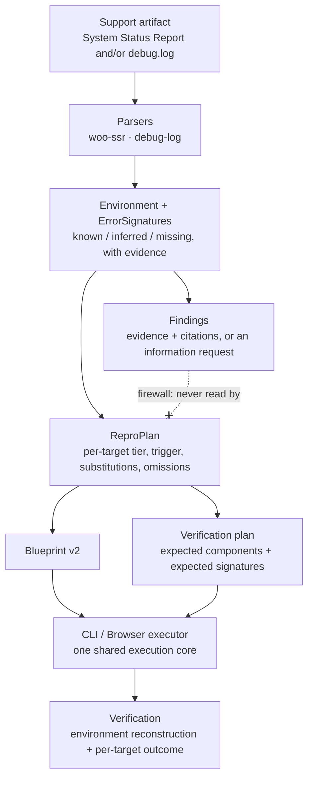

# Final review

State of the MVP as verified on **2026-09-22**: 453 tests passing, typecheck
clean under strict TypeScript, all seven CI jobs green, CLI/browser parity
re-measured at 0 divergences of 9, and `npm run demo` green against a real
WordPress Playground.

Every number and quoted string below was read out of the running system on that
date. Where something does not work, it is stated rather than omitted.

---

## Project summary

A browser-first tool that turns the two artifacts a WooCommerce support ticket
actually arrives with — a System Status Report and a PHP fatal from `debug.log` —
into a canonical environment model with per-field provenance, deterministic
evidence-backed findings with authoritative citations, and a reproducibility plan
that is compiled into a WordPress Playground Blueprint, executed for real on
either the CLI or in the browser, and then *verified* by reading the booted site
back out of WordPress and diffing `debug.log` around the trigger. Its purpose is
to stop the ambiguous "couldn't reproduce" answer: the environment failing to
build, the trigger never running, the trigger running without the failure
appearing, and the failure genuinely reproducing are four distinct outcomes that
the system is built never to conflate. There is no backend, no account system, no
persistence and no model in any decision path.

---

## Architecture

> **The invariant everything else serves:**
> **Reproduction reconstructs the reported environment, not the diagnosis.**



Both the diagnostic layer and the reproduction layer hang off the same IR;
neither is downstream of the other. A wrong diagnosis therefore cannot steer the
reproduction toward confirming itself, which is enforced three ways in
`tests/repro-firewall.test.ts`: no file under `src/repro/` may import the
diagnostic layer, may mention a diagnostic identifier (`Finding`, `severity`,
`confidence`, `citations`, …) with comments stripped, or leak one into the
serialised plan.

Two further structural decisions carry most of the weight:

- **`Field<T>` has exactly three states** — `known`, `inferred`, `missing` — and
  no constructor that accepts a fallback. Absent data can never become a default,
  and `inferred` always carries the basis for the inference.
- **Both executors are one implementation.** `cli-runner.ts` and
  `browser-runner.ts` each only boot an instance and hand it to the shared core
  in `execute/core.ts`; the `debug.log` diff and the `observed` rule live there
  once. Parity between the surfaces is measured, not assumed.

Full detail in [`ARCHITECTURE.md`](ARCHITECTURE.md).

---

## Verified capabilities

Only capabilities backed by a test or by a real execution recorded in this
repository. This is **not** a general WordPress reproduction system: it
reproduces the environment a report describes, for the trigger kinds listed under
[Known limitations](#known-limitations), on WordPress Playground.

| Capability | How it is verified |
| --- | --- |
| WooCommerce System Status Report parsing | 82 tests over 13 committed report fixtures: sections, continuation rows, code fences, CRLF, reordering, unknown fields/sections, must-use plugins, drop-ins, a localised report detected as unreadable |
| `debug.log` / PHP fatal parsing | 33 tests: `ErrorSignature` extraction with ownership attributed in the parser, and no slug guessed for an unmediated directory |
| Evidence-backed findings | 92 tests; the engine discards any match without evidence or without an authoritative citation, and a property test asserts each excerpt appears verbatim at the line it cites |
| Reproducibility planning | 150 tests: per-target A–E tiers, relevance, triggers, substitutions, omissions, and determinism |
| Blueprint generation | 9 tests validating every committed Blueprint against a committed copy of the published v2 schema, plus negative cases so a permissive validator cannot pass |
| Exact plugin-version pinning | Phase 4.5 spike: `slug@version` installs that exact version on both surfaces, confirmed by reading versions back out of the booted site |
| CLI Playground execution | `npm run spike:cli`, `npm run spike:execute` — CI jobs `cli-spike`, `execute-spike` |
| Browser Playground execution | `npm run spike:ui` drives the real UI in Chromium against real Playground — CI job `ui-e2e-spike` |
| Environment verification | Installed components are read back with `get_plugins()` / `get_option('active_plugins')`, never taken from the Blueprint: `classic-editor@1.6.3 (active)` on the quick-start artifact |
| Per-target failure verification | `debug.log` snapshot → trigger → snapshot → diff; `observed = true` reached in demo C (error class `Error`, deterministic extraction), `observed = false` reached and *not* conflated with an environment failure in the executed demo B case |
| CLI/browser parity | `npm run spike:parity` — the same plan on both surfaces, **0 divergences across 9 compared fields**, re-measured 2026-09-22 |

---

## Five-minute demo

Uses [`../fixtures/demos/quick-start.txt`](../fixtures/demos/quick-start.txt) —
the same file CI drives through the real UI on every push, so this walkthrough is
continuously verified rather than verified once.

**1 — Start the app.**

```bash
npm ci && npm run dev
```

Open http://localhost:5173.

**2 — Paste the fixture** into **Support artifact**, leaving **Format** on
*Auto-detect*. It is a small System Status Report followed by a PHP fatal.

**3 — Click Analyze.** Status: *Analysis complete.* Six panels render:
Environment, Findings, Reproducibility, Blueprint, Reproduce, Pasted artifact.

**4 — Inspect the Environment.**

| Field | Value | Provenance |
| --- | --- | --- |
| WordPress | 6.8.2 | `known`, line 4 |
| PHP | 8.2.15 | `known`, line 10 |
| WooCommerce | 8.5.2 | `known`, line 3 |
| Database | MySQL | **`inferred`**, line 11 |
| Web server | nginx/1.18.0 | `known`, line 9 |
| Memory limit | 256 MB | `known`, line 5 |
| Theme | *Not reported* | `missing` |

The database engine is `inferred`, not `known`, because WooCommerce prints every
engine under a `MySQL Version` label. One plugin is listed: `Classic Editor
1.6.3`, active, resolved to slug `classic-editor` through the bundled catalog.

**5 — Click the evidence chip.** The chip in the Findings panel is labelled
`line 21`. Clicking it highlights exactly line 21 of the Pasted artifact — the
`PHP Fatal error: Uncaught Error: Call to undefined function
classic_editor_missing()` line. Exactly one line is highlighted at a time, and
neither the textarea nor the rendered source is mutated.

**6 — Inspect the Finding.** *Fatal error originates in a plugin:
classic-editor* — `Severity: Critical`, `Confidence: high`, rule
`FATAL_PLUGIN_OWNER`. Severity and confidence are independent axes. The panel
carries Explanation, Evidence, Recommended remediation, Citations (*Debugging in
WordPress*, developer.wordpress.org) and Reproducibility impact. Ownership came
from the parsed signature, not from the rule.

**7 — Inspect Reproducibility.** Plan verdict **B — Reproducible with
substitution**. `Target #0`: tier B, `reproducible`, `Trigger supported`, `Owner:
plugin (classic-editor)`, `Attribution confidence: high`, trigger **Activate
plugin: classic-editor**. Three substitutions are listed, none silent — `PHP
8.2.15 → PHP 8.2`, `MySQL 8.0.35 → SQLite`, and debug logging forced on to
capture evidence — along with two omissions (the web server and the PHP memory
limit), each marked *Unknown* relevance.

**8 — View the Blueprint.** Read-only, with *View Blueprint* and *Copy
Blueprint*. It pins `classic-editor@1.6.3`, `wordpressVersion: "6.8.2"`,
`phpVersion: "8.2"`, and states that it represents the reported environment, not
a recommended one.

**9 — Reproduce in Playground.** Four stages run in order: Booting → Checking
what actually installed → Executing reproduction triggers → Collecting
verification results. A real WordPress renders in the panel; measured **14.5 s
and 17.9 s** end to end on a warm cache.

**10 — Inspect environment verification.** *Environment reconstruction:* **Boot
succeeded**, `Installed components (1)` → `classic-editor@1.6.3 (active)`,
`Failed components (0)` — read back out of WordPress rather than assumed.

**11 — Inspect target verification.** *Target #0:* **Trigger attempted, failure
not observed**. Attempted **Yes**, Observed **No**, reason *"the trigger ran and
wrote no new debug.log entries"*. That is the correct answer: the synthetic fatal
in the artifact does not occur in Classic Editor 1.6.3, so the environment was
rebuilt, the trigger really ran, and the failure did not appear — three separate
facts rather than one misleading verdict.

### Demo B — the verified environment-failure example

[`../fixtures/demos/demo-b-plugin-fatal.txt`](../fixtures/demos/demo-b-plugin-fatal.txt)
analyses cleanly (WordPress 6.4.3, PHP 8.1.27, WooCommerce 8.5.2, Storefront, 6
plugins; `FATAL_PLUGIN_OWNER` critical/high; tier B; trigger `Activate plugin:
woocommerce`; Blueprint pinning `woocommerce@8.5.2`) but its environment **does
not boot**.

`wordfence@7.11.4` throws `WP_MySQL_On_SQLite_Exception` from `wfDB.php` during
activation, because Playground runs on SQLite rather than MySQL. Installation is
all-or-nothing, so all six components are reported as failed and the target's
outcome is **Environment failed** — *"The environment did not boot, so this
target's trigger was never run. This says nothing about whether the reported
failure is reproducible."*

Verified deterministic on both the CLI and browser surfaces, and isolated to that
one plugin: dropping `wordfence@7.11.4` boots the same environment with
`woocommerce@8.5.2 (active)` and four other plugins installed. The fixture is
deliberately left unchanged — an honest *Environment failed* demonstrates the
distinction the product exists for, and editing the fixture until it passed would
have destroyed the evidence.

---

## Test coverage

**453 tests across 9 suites, running offline in ~1.5 s.** No network, no
database, no Playground: every fixture, schema and catalog entry they read is
committed.

| Suite | Tests | Category |
| --- | --- | --- |
| `woo-ssr-parser` | 82 | Parser |
| `debug-log-parser` | 33 | Parser |
| `rules` | 92 | Diagnostic rules |
| `repro-planner` | 150 | Planner |
| `log-evidence` | 23 | Verification / evidence (pure) |
| `ui/app` | 40 | UI |
| `ui/analyze` | 16 | UI |
| `blueprint-schema` | 9 | Unit / schema |
| `repro-firewall` | 8 | Unit / structural |

Two cross-cutting checks run inside those suites: a **property test** asserting
every `Finding`'s evidence excerpt appears verbatim at the line it cites, for
every diagnosis case; and a **determinism check** running each parser fixture,
diagnosis case and planner case twice and comparing.

Everything below boots a real Playground and therefore needs network access:

| Command | Category | What it proves |
| --- | --- | --- |
| `npm run spike:cli` | CLI integration | A Blueprint boots headlessly and the running site is introspected instead of trusting an exit code |
| `npm run spike:execute` | CLI integration | The full execute-and-verify path on the CLI surface |
| `npm run spike:parity` | Browser integration | The same plan on both surfaces, compared field by field — 0 divergences of 9 |
| `npm run spike:ui` | UI E2E | The real application in Chromium against real Playground, asserting the site rendered by reading the frame's own document rather than pixels |
| `npm run demo` | Demo E2E | Four demos, including one target reaching `observed = true` and one reaching `observed = false` without being conflated with an environment failure |

---

## CI

Seven jobs on `ubuntu-latest`, on every push. All seven green on the most recent
run (2026-09-22).

| Job | Runs | Status |
| --- | --- | --- |
| `check` | `npm run typecheck` + `npm test` | ✅ |
| `cli-spike` | `npm run spike:cli` | ✅ |
| `execute-spike` | `npm run spike:execute` | ✅ |
| `browser-parity-spike` | spike server + `npm run spike:parity` | ✅ |
| `ui-e2e-spike` | dev server + `npm run spike:ui` | ✅ |
| `demo-e2e` | `npm run demo` | ✅ |
| `v2-plugins-probe` | Re-checks, on Linux, the Blueprint v2 + plugins failure first seen on macOS in Phase 0 | ✅ |

---

## Known limitations

Established by experiment, with sources in `docs/phase-*-findings.md`.

**Environment fidelity**

1. **Playground runs on SQLite, not MySQL/MariaDB.** Every reported MySQL site is
   reconstructed on a different engine, recorded as an explicit substitution —
   which is why **tier A is unreachable** for any report naming a database. Tier
   C is defined but unreached by any current fixture.
2. **PHP is pinned to major.minor.** A reported patch release cannot be
   reproduced. Playground offers 5.2, 7.4 and 8.0–8.5 — notably not 7.0–7.3.
3. **The web server and PHP memory limit cannot be reproduced** and are recorded
   as omissions with unknown relevance.

**Components**

4. **Installation is all-or-nothing: one failing component aborts the whole
   boot.** That covers a version that cannot be downloaded and a plugin that
   installs but fatals under SQLite — `wordfence@7.11.4` is the verified example.
   Every target is then reported as *Environment failed*, never as *not
   reproduced*.
5. **A pinned version only resolves while the package is published.**
   `slug@version` is fetched from wordpress.org; nothing nearby is substituted
   for a withdrawn version.
6. **Premium, unresolved, must-use and drop-in components and themes cannot be
   installed.** Each becomes an explicit omission with a reason, and a target
   blocked this way is classified tier **D** and never attempted. A slug is never
   guessed from a display name.
7. **Slugs resolve only through a bundled 31-entry catalog** keyed by
   `(name, author)`, so coverage of real reports is partial by design.
8. **"Relevant omission" is conservative to the point of being structurally
   almost unreachable**, because the components that cannot be installed are
   exactly those whose slugs are unknown, and implication requires a known path.

**Reproduction and evidence**

9. **Supported triggers are boot, plugin activation and admin page load only.**
   Checkout, webhooks and payment callbacks have no executable trigger and are
   never claimed.
10. **Plugin activation is really re-activation** (deactivate, then activate),
    because the Blueprint activates at boot. Recorded on every affected result.
11. **Only newly written `debug.log` entries count as evidence.** Entries present
    before the trigger are discarded, so a boot-time error can never be sold as a
    reproduction — but a failure that writes nothing to the log cannot be
    observed here at all.
12. **No structured PHP error data exists in any Playground surface.** Error class
    and message are regex extractions from raw log text, and each target records
    the extraction source and whether it was deterministic.

**Runtime and scope**

13. **Browser results are verified in headless Chromium only**, and the embedding
    page must not be cross-origin isolated or the Playground iframe is blocked.
14. **Only English plain-text System Status exports are parsed.** A localised
    report is detected and reported as unreadable rather than silently parsed as
    empty.
15. **Network is required** to launch any reproduction, and boots fail
    transiently: one `npm run demo` run on 2026-09-22 failed with *"Error
    connecting to the SQLite database"* and the next, unchanged, passed.
16. **The diagnostic corpus is 4 rules and 11 recorded version requirements**,
    deliberately — rules without an authoritative source were not written.

---

## Technical debt

Genuine, currently-confirmed issues. Absent features that were never in scope are
not listed here.

1. **The `debug-log` adapter returns only the first fatal it finds.** The
   composition layer works around this by splitting a paste into one block per
   fatal and padding each with newlines so line numbers survive — a workaround
   living above the adapter rather than a fix inside it.
2. **The plugin catalog is 31 hand-curated entries.** It is the single gate on
   slug resolution, so coverage of arbitrary real-world reports is low, and
   growing it is manual work.
3. **No persistence and no export.** A result cannot be saved, shared or attached
   to a ticket; closing the tab loses it.
4. **Browser verification is Chromium-only.** No other engine has been measured,
   so cross-browser behaviour is unknown rather than known-good.
5. **The demo runner retries only Demo C's boot.** A transient infrastructure
   failure anywhere else in `npm run demo` surfaces as ordinary red checks rather
   than as the infrastructure failure it is — observed on 2026-09-22.
6. **`spike/execute/sample.ts` still carries its own inline artifact**, similar
   to `fixtures/demos/quick-start.txt`. It cannot simply read the fixture because
   that module is bundled into a browser spike page where `readFileSync` does not
   exist, so the two can drift.
7. **Long artifacts render every source line eagerly.** A large paste produces a
   correspondingly large DOM, with no virtualisation.

---

## Interview talking points

**1 — Why a canonical Environment IR was necessary.** Two adapters with
different shapes (a structured report, an unstructured log) feed one downstream
pipeline. Without a canonical IR, every rule and the planner would each have to
know both input shapes, and "absent" would be expressed differently in each path.
The IR also makes the three-state `Field<T>` enforceable in one place: there is
no constructor accepting a fallback, so "not reported" cannot decay into a
default anywhere downstream.

**2 — Why diagnosis and reproduction are separated.** If the planner could read a
`Finding`, a wrong diagnosis would select the trigger that confirms it, and the
reproduction would become a circular proof of the diagnosis. Separating them
means the reproduction tests *the reported environment* independently, so it can
contradict the diagnosis. The import-edge check alone was not enough — reading a
conclusion through a structural type or `any` would pass it — so the test also
forbids the diagnostic identifiers textually and checks the serialised plan for
leakage.

**3 — Why every Finding requires evidence and a citation.** Both gates are
enforced centrally in the engine, not per rule, so a rule cannot opt out: a match
with no evidence or no citation is discarded rather than downgraded. Evidence is
the customer's own verbatim line with a locator, which is what lets the UI link a
conclusion back to the source text; the citation must be an authoritative host,
and version-specific requirements cite the exact version's own `readme.txt`. A
version absent from the requirements table makes the rule `not_applicable`
instead of extrapolating.

**4 — Why the SQLite substitution affects the tier.** Playground has no MySQL, so
any reported MySQL/MariaDB site is reconstructed on a different database engine.
That is a material difference from the reported environment, so the target cannot
be tier A ("reproducible") — it is tier B, "reproducible with substitution", and
the substitution is listed beside the Blueprint. The practical consequence is
that tier A is unreachable for any report that names a database, which is stated
rather than hidden, and Wordfence's `WP_MySQL_On_SQLite_Exception` is what that
substitution costs in the worst case.

**5 — Why `debug.log` before/after diffing is the verification method.** No
Playground surface exposes structured PHP error data — `originalErrorClassName`
is the JS wrapper's name, and a CLI fatal still returns HTTP 200 — so an honest
signal had to come from the site itself. Snapshot, run the trigger, snapshot
again, and treat only the newly written entries as evidence. Entries that existed
before the trigger are discarded, which is precisely what stops a boot-time error
being reported as a reproduction.

**6 — How infrastructure failures were separated from reproduction failures.**
They are different outcomes in the model, not different messages: `observed` is
true only when the trigger actually ran *and* what it produced matches the
report, a failed boot outranks every other outcome, and a run that cannot
complete at all is surfaced as an infrastructure failure with an explicit note
that it says nothing about reproducibility. The same discipline applies to the
tooling — the demo runner labels a boot failure that survives a retry as an
infrastructure failure rather than a demo regression.

**7 — How CLI/browser parity was verified experimentally.** Sharing a core
guarantees the code is the same, not that the surfaces behave the same — the
runtimes differ (Node versus wasm in an iframe). So the same plan is executed on
both surfaces and nine fields are compared: boot success, installed and failed
components, target count, and per-target attempted / observed / trigger / error
class / reason. The result is 0 divergences of 9. The browser side of the same
run also compares its extracted signature against a deliberately wrong one
(`TypeError` / "something entirely different") and reports no match, so the
comparison is demonstrably capable of failing rather than matching everything.
